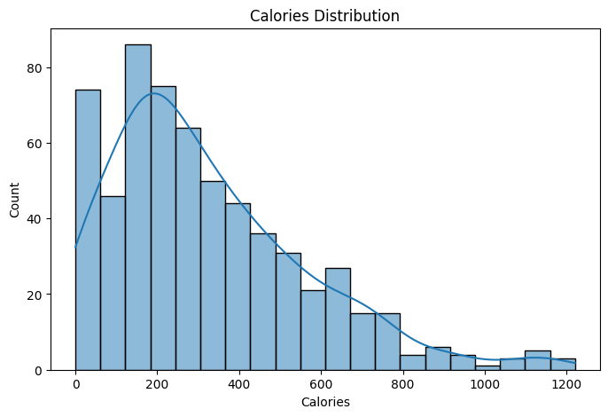
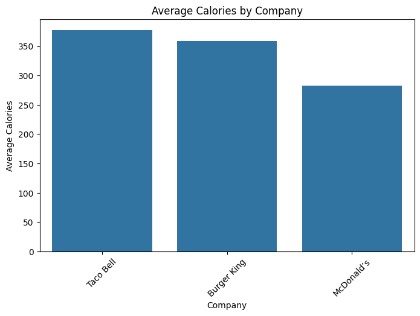
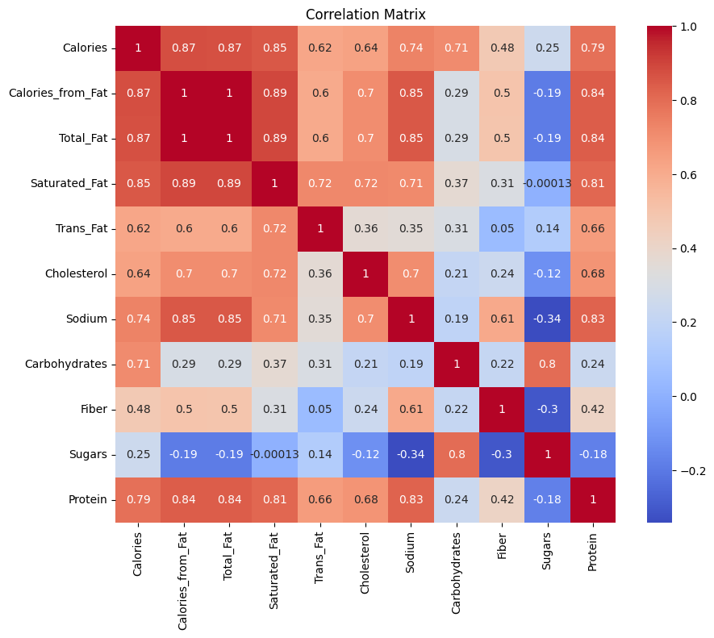

# Fast Food Nutrition Analysis – Data Analyst Project

## Problem Statement
People often consume fast food regularly but lack clear insights into the nutritional content of each menu item, such as calories, fat, sugar, and protein. Without this information, making healthy choices can be difficult.

This project aims to analyze fast food nutritional data to:

- Identify menu items with the highest calories and fat  
- Compare average nutritional values across different companies  
- Provide actionable insights for health-conscious consumers

---

## Objective
- Analyze nutritional information of fast food items  
- Visualize patterns and correlations in the data  
- Summarize key insights that can guide healthier choices or menu planning

---

## Dataset
**Fast Food Nutrition Dataset**  
- Approximately 9 sample items (expandable to real datasets with 50+ items)  
- Features include:
  - Company (e.g., McDonald's, KFC, Starbucks)  
  - Item name  
  - Calories  
  - Calories from Fat  
  - Total Fat, Saturated Fat, Trans Fat  
  - Cholesterol, Sodium  
  - Carbohydrates, Fiber, Sugars  
  - Protein  
  - Weight Watchers Points

**Sample Data:**

| Company      | Item                  | Calories | Total_Fat | Protein |
|-------------|----------------------|---------|-----------|---------|
| McDonald's  | Big Mac              | 550     | 30        | 25      |
| McDonald's  | Fries Large          | 500     | 26        | 7       |
| KFC         | Fried Chicken        | 450     | 30        | 35      |
| Subway      | Turkey Sandwich      | 280     | 7         | 18      |
| Starbucks   | Caffe Latte          | 190     | 8         | 12      |

---

## Tools & Skills
- Python (pandas, numpy)  
- Data Visualization (matplotlib, seaborn)  
- Exploratory Data Analysis (EDA)  
- Data Cleaning & Preprocessing  
- Business Insight & Data Storytelling  

---

## Analysis Workflow
1. Data loading and overview  
2. Data cleaning and preprocessing  
   - Rename columns for consistency  
   - Convert numeric columns to proper format  
3. Exploratory Data Analysis (EDA)  
   - Distribution of calories  
   - Average calories by company  
   - Correlation matrix between nutrients  
4. Visualization of top calorie items  
5. Summarizing key insights and recommendations

---

## Model Performance / Visualization (Example Graphs)

**Calories Distribution**

**Average Calories by Company**

**Correlation Matrix of Nutritional Values**

**Top 10 Highest Calorie Items**

---

## Key Insights
1. Menu items with the highest calories usually come from **McDonald's and Pizza Hut**.  
2. Companies with higher average calories typically serve more **fast food items**.  
3. Calories are strongly correlated with **Total Fat**, meaning high-fat items tend to be high-calorie.  
4. Salad and beverage items generally have low calories and are better options for calorie-conscious consumers.  

---

## Business / Practical Recommendations
- Promote healthier menu options by highlighting low-calorie items (e.g., salads, beverages)  
- Reformulate menu items to reduce fat while maintaining flavor  
- Educate consumers with clear nutritional information to guide choices  
- Use insights to design marketing campaigns for healthier options

---

## Conclusion
This project demonstrates how **data analysis and visualization** can be applied to understand nutritional content in fast food.  
The insights can help businesses design healthier menus and guide consumers to make informed choices, ultimately promoting better health outcomes.

---

## Author
**Dolthida**  
Computer Science Student | Aspiring Data Analyst
